# VC6 Ultimate

VC6 Ultimate is a non-official collection of 500+ fixes, tweaks and new features for Visual C++ 6.0. These improvements make VC6 Ultimate an outstanding C++ IDE.

Let's celebrate VC6's 20th anniversary by sharing them to the world.

## Why improving upon Visual C++ 6.0?

We think Visual C++ 6.0 was the best dev env ever made.
It does have weaknesses though, so we kept improving it with over 500 bugfixes, tweaks and new features.

## Main Features

* Fully portable and Win7/10 compatible
* Multicore version of VC7.1 compiler (It's fast)
* Real-time highlighting and diagnostics
* Real multicursor editing
* Improved UX and UI, including DarkSkin Theme
* Free (as in free beer)
* Every change has a toggle

It also perfectly integrates with Whole Tomato's [Visual Assist X](https://www.wholetomato.com).

See [VC6 Ultimate's homepage](http://vc6.ultim.pw) for a whole lot of VC6 Ultimate eye candy.

## Installation

* Edit "VisualUltimate\VS_Config\DevStudio#6.0.hjson" and replace every occurrence of "C:\\Program Files\\Microsoft Visual Studio" by the location you downloaded VC6 Ultimate to (e.g. "C:\\VC6").
* Edit the VC6 shortcut (VC6.lnk): right click on VC6.lnk > Properties. In the "Target" and "Start in" fields, replace every occurrence of "C:\Program Files\Microsoft Visual Studio" by the location you downloaded VC6 Ultimate to (e.g. "C:\\VC6").
* If you want to enable Visual Assist X, open a cmd with administrator rights. Cd to directory "VisualUltimate/AddIns/Visual Assist X" and execute the following command: "regsvr32 VAssist.dll". Visual Assist X is shipped with VC6 Ultimate but obviously without a purchased license. Please note that VC6 Ultimate is only compatible with this exact version of Visual Assist X.

## Features List

Each feature can be enabled or disabled. Only take what you like, but be aware we cannot check every combination.

It's an internal spare time project so don't expect everything to work in every setup, but feel free to [reach out](mailto:vc6@ultim.pw) or report any issue you may encounter.

### Source Code - Current Line

|Feature|Details|Demo|
|---|---|---|
|Highlight current line|Highlights the current line. Three styles are available.|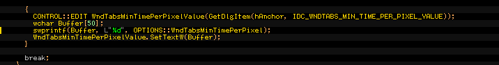|
|Highlight current line margin||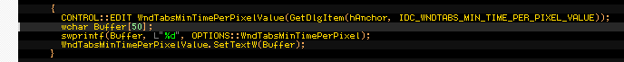|
|Always center the view on the current line|||
|LineEnd command ignores trailing whitespaces on first call|The 'LineEnd' command first stops at the trailing whitespaces, then jumps to the end of line like the original function|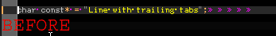|
|Use LineCut instead of Cut when no text is selected|||

### Source Code - Tooltips

|Feature|Details|Demo|
|---|---|---|
|Fix Tooltip Display on Multi-Monitors||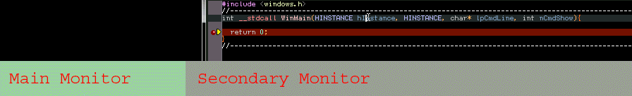|
|Allow Multi-line Tooltips|||
|Display Tooltip Above Cursor Position||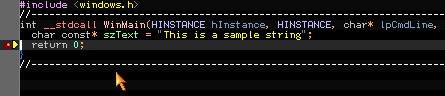|
|Enhanced Watch Tooltips (type and color)||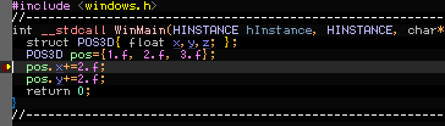|
|Dockable Tooltips||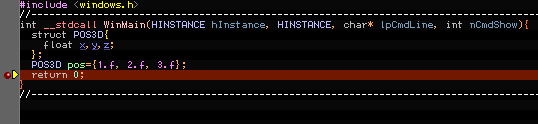|
|Remain visible when trying to reach the tooltip||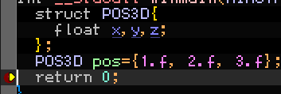|
|Dock at end of current line||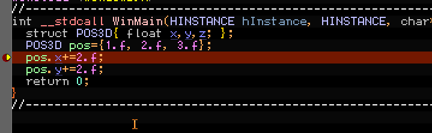|
|Set Tooltip Delay||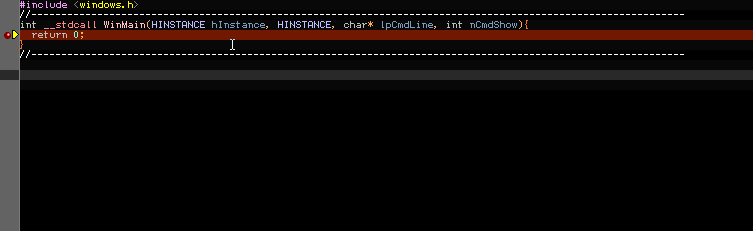|

### Source Code - Colors

Fine-grained Clang code highlighting customization: 50+ configurable coloring rules, plus underlining and markers.

### Source Code - On-the-fly error messages

Display on-the-fly Clang Error Messages directly in source code edition view.

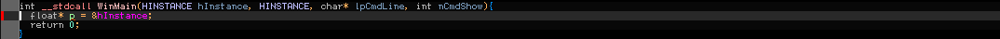

### Source Code - Left Margin

|Feature|Details|Demo|
|---|---|---|
|Modify Bookmark, Breakpoint, Current Statement, Current Error, Calls Highlight Signs||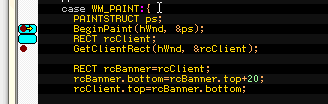|
|Display Line Modified Status in margin||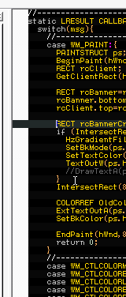|
|Display Line Number||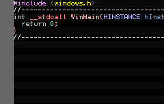|
|Use Clang Colorization||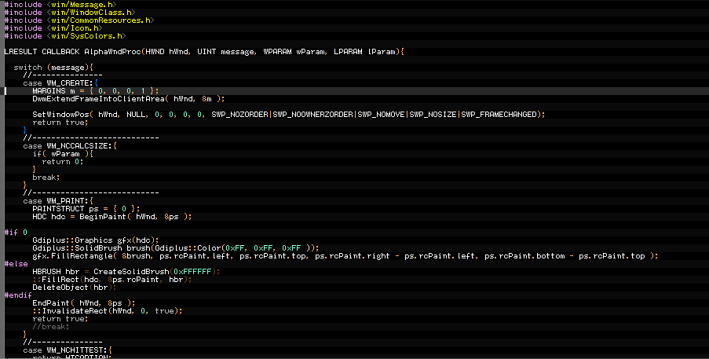|
|Display Line error Status||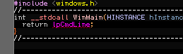|

### Source Code - Selected Text

VC6 Ultimate has **advanced multicursor editing**.

|Feature|Details|Demo|
|---|---|---|
|Keep Selection Highlight in Inactive Windows|||
|Enable Syntax Highlighting on Selected Text||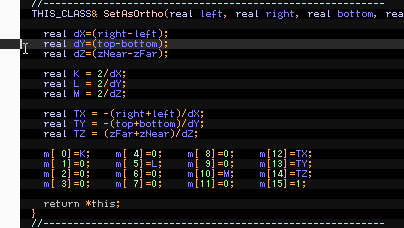|
|Extend Selection Highlight to Full Lines||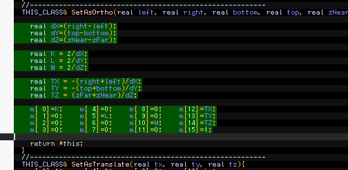|
|Display a different Caret in Overwrite Mode||bChangeCaretInInsertMode.gif|
|Single Selection Caret Color||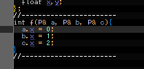|
|Multiple Selection Caret Color|||
|Draw a Blinking Border when there is an off-screen selection||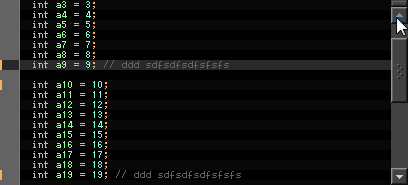|
|Use tiny I-Beam pointer with small fonts (<=10)||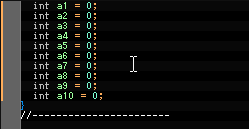|
|Display Selections Count in SushiBar||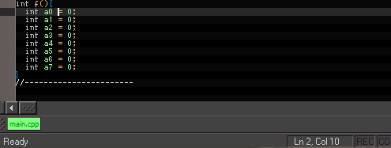|
|Display Selections' Bytes and Columns Count in SushiBar|||
|When a MultiSelection is cancelled, Merge all the Copy Buffers||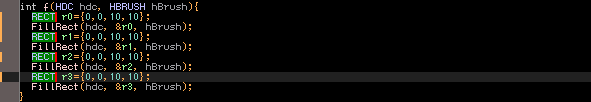|
|Insert \\r\\n between Copy Buffers||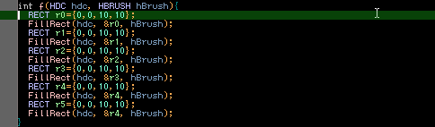|

### Source Code - Custom Code Blocks
|Feature|Details|Demo|
|---|---|---|
|Enable Custom Code Blocks Display||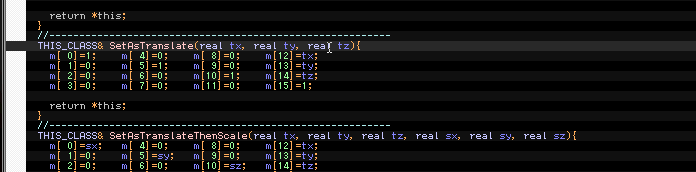|
|Highlight Odd Lines Background|||
|Extend Background Color to Full Lines|||

### Source Code - Highlights

|Feature|Details|Demo|
|---|---|---|
|Highlight Selected Word Occurrences|Can also be disabled for comments occurrences||
|Highlight Odd Lines Background|||
|Highlight Lines containing \"///!\" comment||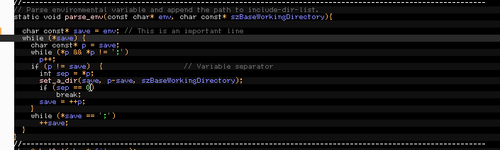|
|Highlight Breakpoint Lines||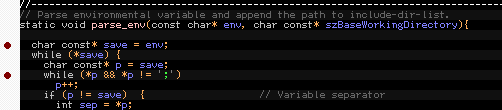|
|Highlight Bookmark Lines||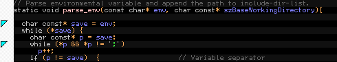|
|Use Special Color for '//--' comments|||
|Use Special Color for '///--' comments|||
|Use Special Color for '////--' comments||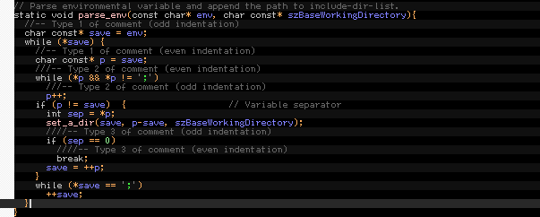|
|Gray Out Disabled Lines (#if 0)||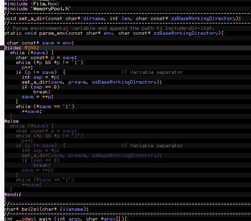|

#### Source Code - Enhanced Display

|Feature|Details|Demo|
|---|---|---|
|Use Special Color for Doxygen comments|||
|Check printf format String Syntax||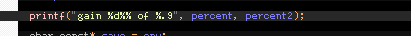|
|Check String Escape Sequences|Also emits syntax warnings using a special color||
|Underline local symbols|||
|Underline stable symbols|||
|Enable image popups (\@IMG)||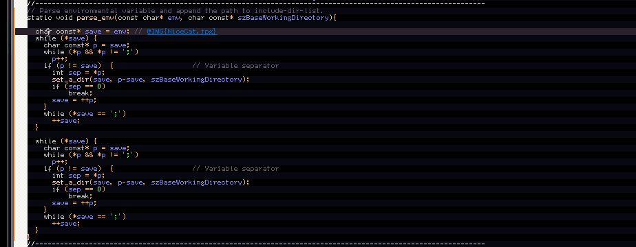|
|Enable color preview and popups (\@BGR|\@RGB|\@RGBf)||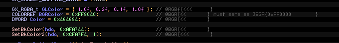|
|Enable LaTeX popups (\@LTX)||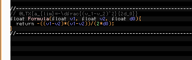|
|Show three dots at the end of non-fully visible lines|||
|Show blinking arrow at the end of lines with off-screen highlights|||
|Force Visual Assist Navigation Bar background color|||
|Use OpenGL to render text|||
|Use Special color for Preprocessor Keywords|||
|Use Special Color for colon (:) operator||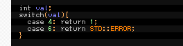|
|Use Special Color for Float Numbers||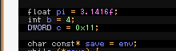|
|Use Special Color for Preprocessor Sub Keywords||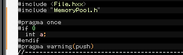|
|Use Special Color for Microsoft Specific Keywords||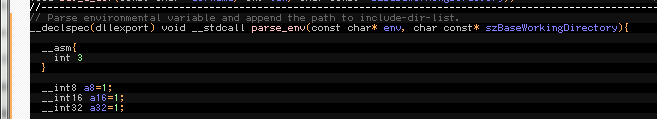|
|Use Special Color for Multicharacter Constants||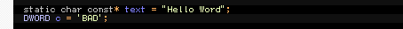|
|Use Special Color for String and Character Delimiters|||
|Use Special Color for Odd Parentheses Nested Blocks|||
|Highlight Current Block Boundaries () [] {}|||
|Preprocessor Symbols Color|||
|Highlight Current Scope|||
|Display Mini Map in Right Margin|||
|Alternate Display of Visible Whitespaces|||
|Open Links on Double-Click||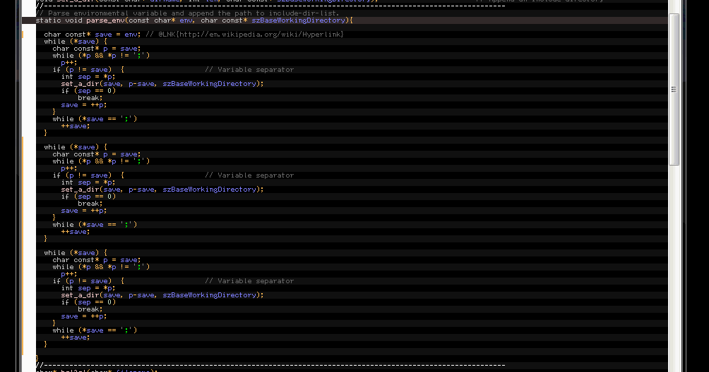|

### Source Code - Context Menu

|Feature|Details|Demo|
|---|---|---|
|Add Visual Ultimate Options||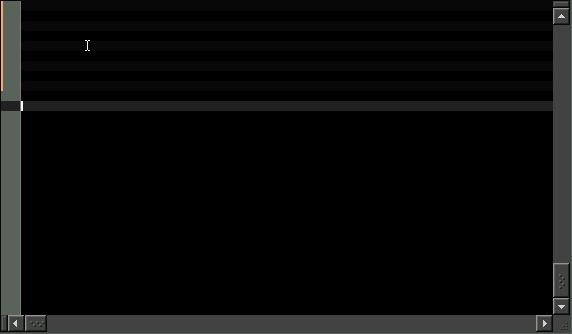|
|Remove Browsing Commands||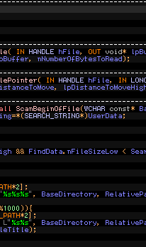|
|Add Visual Ultimate 'Show Preprocessed Content'||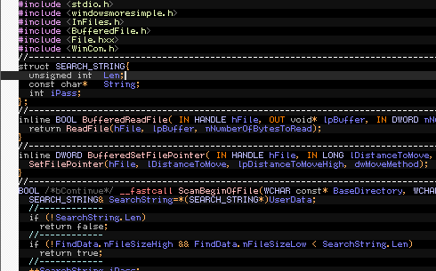|
|Add Visual Ultimate 'Open Containing Folder'||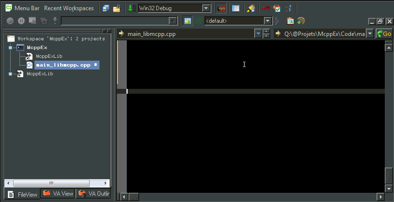|
|Add Visual Ultimate 'Find in Workspace View'||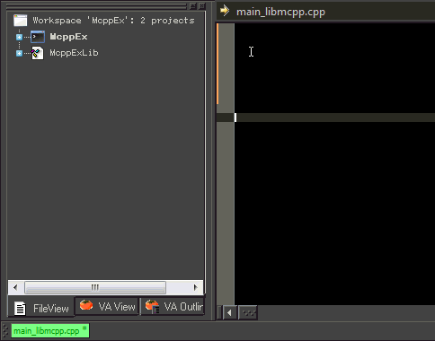|
|Display Containing Project into 'Insert File Into Project'||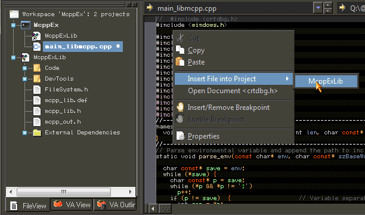|

### Source Code - Fonts

|Feature|Details|Demo|
|---|---|---|
|Use Ctrl + MouseWheel to Change current font family and size|Useful for zooming or trying other fonts|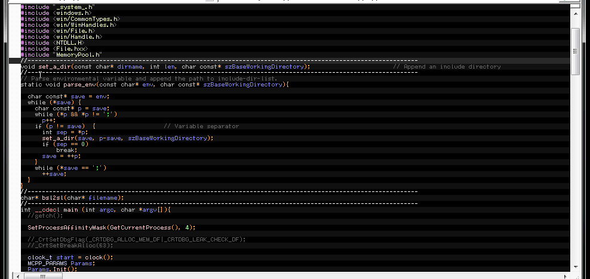|
|Allow 'Antialised' Quality for source code fonts|||
|Improve Font Quality by using Custom Anti-Aliasing|||

### Source Code - C++ Parsing

|Feature|Details|Demo|
|---|---|---|
|Improve the parsing of numeric values|||
|Parse assembly hexadecimal values correctly (e.g. \"10h\")|||

### Source Code - Completion

|Feature|Details|Demo|
|---|---|---|
|Insert closing ) after (|||
|Insert closing } after {|||
|Insert closing ] after [|||
|Insert closing \" after \"|||
|Insert closing ' after '|||
|Surround selection on /|||
|Surround selection on *|||
|Surround selection on (|||
|Surround selection on {|||
|Surround selection on #|||

### Output Window

|Feature|Details|Demo|
|---|---|---|
|Enable Ultimate Output|||
|Use Ultimate 'Macros' Tab|||
|Use Ultimate 'Build' Tab|||
|Use Ultimate 'Debug' Tab|||
|Use Ultimate 'Clang' Tab|||
|Auto Set Debug Tab as Current|||
|Enable Enhanced Output Window Colors|||

### Output Window - Notifications

|Feature|Details|Demo|
|---|---|---|
|Avoid \"Could not find the file [filename]\" messages|||
|Don't display the \"The thread ... has exited with code ...\" message|||
|Don't display the \"The program '...' has exited with code ...\" message|||
|Don't display the \"Error executing ...\" message|||
|Don't display the \"Deleting intermediate files and output files ...\" message|||
|Delete logs at start|||
|Redirect seemingly useless debugger messages|||
|Redirect specific debugger messages depending on type|||

### Output Window - Advanced Options

|Feature|Details|Demo|
|---|---|---|
|GoToNextErrorTag/GoToPrevErrorTag jump on errors only|||
|Add Output Tab for Visual Assist References|||
|Avoid splitting long Output lines|||
|OutputDebugString(\"\\0xC\") clears the output debug panel|||
|Enable Extended Text Formatting using OutputDebugString (e.g. \"\\ftFF00FFHello\\f/t\")|||
|Display Format Colors in Text|||

### Project Files

|Feature|Details|Demo|
|---|---|---|
|Save Workspace when saving all source files|||
|Change Source File Jumps in DSP File|||
|Remove Unnecessary Lines in DSP File|||
|Avoid overwriting non-modified files|||
|Save Workspace Settings (.OPT) in XML format (.SETTINGS)|||
|Load Workspace Settings (.OPT) from XML format (.SETTINGS)|||
|Save .OPT Settings in XML Files|||
|Remove Workspace Settings file (.OPT)|||
|Force Build Tools order inside .DSP File|||
|Allow .NET Project Importation (.sln/.vcproject)|||
|Save 'General' Settings per computer|||

### Resource File

|Feature|Details|Demo|
|---|---|---|
|Disable 80 columns limit in resource files (.rc)|||
|Open resource files (.rc) in text mode|||

### Debug

|Feature|Details|Demo|
|---|---|---|
|Alternate Dialog for 'Resolve Source Line Ambiguity' dialog||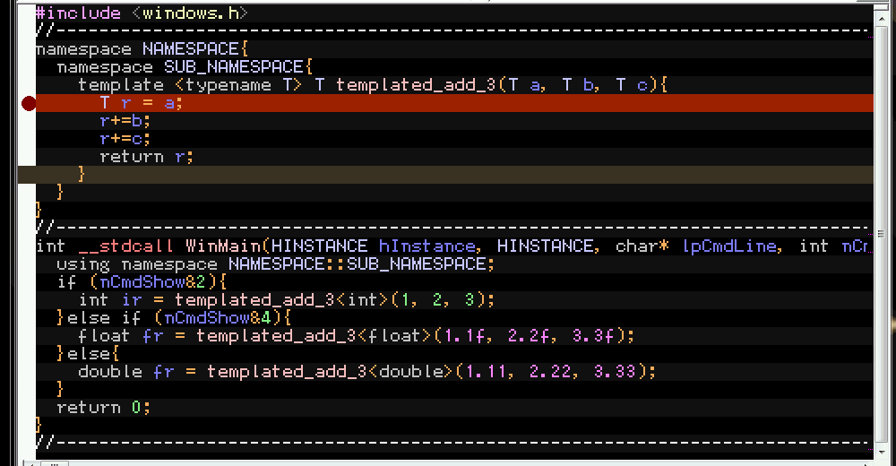|
|Give the choice to Continue Execution at Debug Start when a Breakpoint is Invalid||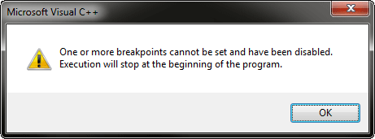|
|Fix 'Stop Debugging Program' on Win7|||
|Improve Callstack/ThreadList Symbols and Dialog|||
|Display common waiting functions in gray|The considered waiting functions list can be customized||
|Alternate Dialog for Exceptions Management|||
|Alternate Dialog for CPU Registers|||
|Use executable directory as default working directory|||
|Auto-Fill executable image for remote debugging|||
|Fix: DebugRestart doesn't stop at the first instruction anymore|||

### Debug - Assembly View

|Feature|Details|Demo|
|---|---|---|
|Improve the Assembly View|Configure colors for memory address, assembly bytes, line numbers, file names, symbols||
|Highlight register aliases (e.g. eax -> ax,ah,al)|||
|Highlight selected word||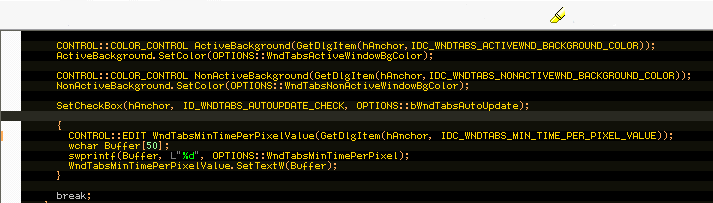|
|Highlight selected text in inactive windows too|||

### Debug - Breakpoints

|Feature|Details|Demo|
|---|---|---|
|Double-clicking a Breakpoint in breakpoints list jumps to its location|||
|Display breakpoint's surrounding code|||
|Use a fixed-width font in breakpoints list|||
|Append breakpoint's corresponding source code in breakpoints list|||
|Fix: Auto Breakpoint Location|||
|Increase breakpoints list height|||

### Watches

|Feature|Details|Demo|
|---|---|---|
|Configure watches colors|||
|Custom AutoExp.dat path|||
|Auto Reload AutoExp.dat when modified|||
|Add 'Type' Column in Watch Window|||
|Exclude 'Type' Column when copying a watch|||
|Use a specific AutoExp.ini file per Project|||
|Edit AutoExp directly from Watch Window|||
|Increase Watch Value Max Length from 256 to 1024 chars|||
|Allow Multiline Watches (/mb#, /ma#, ...)|||
|Display hexa watch values in uppercase|||
|Use full ANSI table (char>=0x80) in memory watch|||
|Add /sU format to display UTF-8 strings|||
|Add Custom Formatting in watch submenu|||
|Add /b format to display binary representations|||
|Add /bgr and /rgb format to display colors (and \@RGB{}/\@BGR{} in type format)|||
|Allow editing watch size of arrays|||
|Simplify dragged & dropped Expressions|||
|Increase Max AutoExp Expression Length to 4096 instead of 256|||
|Enable Nested AutoExp Expressions|Max Depth can be configured||
|Evaluate Watch/AutoExp expressions|e.g. \"width:\@{<right>-<left>}\") (e.g. \"\@d{..}\" for double||
|Remove trailing carriage return on Watch copy|||
|Add Sign on Watched for modification fields|||
|Use Extended AutoExp Format|e.g. \"<right> <= <left>\", \"$right $(left,d)\", \"Price:$(price)\\$\"||
|Expand tab characters when displaying strings|||
|In modes /mb and /ma, only highlight modified chars|||
|Improve message names \",wm\"|||
|Display empty watch tabs with grayed title|||
|Display a shadowed version of the previous watch value|||
|Display unknown pointers as memory|||

### Find in Files

|Feature|Details|Demo|
|---|---|---|
|Use Visual Ultimate \"Find In Files\"|||
|Customize \"Find in Files\" Font|||
|Show Matching Lines in scrollbar|||
|Increase MRU List Size from 16 items to 64|||
|Remove '\\VCProject' from default search folder|||
|Restore Dialog's Size and Position|Can be saved per computer||
|Return line number AND character position|||
|Code Line|||
|Active Code Line|||

### Find / Replace

|Feature|Details|Demo|
|---|---|---|
|Resizable 'Replace' Dialog|||
|Restore Replace Dialog's Size and Position|Can be saved per computer||
|Resizable 'Find' Dialog|||
|Restore Find Dialog's Size and Position|||
|Save Position per computer|Can be saved per computer||

### Notifications

|Feature|Details|Demo|
|---|---|---|
|Disable \"Cannot access the ClassView information file.\" message|||
|Disable \"Do you want to close all documents?\" confirmation|||
|Avoid \"The project settings have changed since the last build. Would ...\" confirmation|||
|Disable \"Lines ending with only a carriage return have been detected ...\" message|||
|Disable \"The file '%s' is unicode and cannot be read.\" message|||
|Disable \"The file contains invalid characters that will be converted to '.'s\" message|||
|Disable \"One or more files are out of date ... Would you like to build them?\" message|||
|Auto-answer \"Yes\" to \"This file does not exist.  Do you want to build it?\" message|||
|Set a Build Complete Sound|Can be disabled when VS has focus||
|Build Up-to-date Sound|Can be disabled when VS has focus||
|Build Warning Sound|Can be disabled when VS has focus||
|Build Error Sound|Can be disabled when VS has focus||
|Modify Watches expansion threshold for requiring confirmation|||

### Main Window

|Feature|Details|Demo|
|---|---|---|
|DarkSkin Theme|||
|Display Full File Path in Title|||
|Remove Application Name from Title|||
|Flash Main Window after Build|||
|Show Build Progress Bar in Taskbar Button|||
|Show Debug State in Taskbar Button|||
|Fill SushiBar with Debug State Color|||
|Fix FullScreen Display|||
|Fix Status Bar on Big Screens|||

### Sub Windows

|Feature|Details|Demo|
|---|---|---|
|Use Ultimate Docking|||
|Double-Clicking the Title Bar Toggles FullScreen (Maximize) instead of Docking|||

### Toolbars and Menus

|Feature|Details|Demo|
|---|---|---|
|Save Custom Toolbar Icons in 32bits|||
|Use Gray Images for Disabled Items|||
|Disable the 'Alt' Only shortcut (Giving Focus to Menu)|||
|Allow Hotkeys to use only a modifier key (Alt/Ctrl/Win/Shift)|||
|Disable the Default Action (i.e. Context Menu) of Apps Key|||
|Always Display the active Window Icon in the Toolbar|||

### Workspace Window

|Feature|Details|Demo|
|---|---|---|
|Enable Dropping Files in 'FileView' tree|||
|Ask for adding to Hg|||
|Check Hg Before Asking for Adding|||
|Display Project Name Only in 'FileView' tree (no ' Files' suffix)|||
|Display Source File Path in 'FileView' tree|||
|Add * On Dirty Source File in 'FileView' tree|||
|Highlight Source File in 'FileView' tree|||
|Highlight Selected Item in non focused 'FileView' tree|||
|Replace Workspace Icons in 'FileView' tree|||
|Add 'FileView' Options in 'FileView' context menu|||
|Add 'Dependencies' menu item in project context menu|||

### Dependencies Scan

|Feature|Details|Demo|
|---|---|---|
|Force Dependencies Location|||
|Force the Dependencies Scan when the computer name has changed|||
|Display Progress Bar while building dependencies tree|||
|Remove /FD (Generate file dependencies) switch|||
|Fix date file set in the future|||

### Window Tabs

|Feature|Details|Demo|
|---|---|---|
|Set color for active window tab|||
|Set color for other window tab|||
|Set Min Time Per Pixel|||
|Auto Update|||

### Macros

|Feature|Details|Demo|
|---|---|---|
|Add 10 Extra Parameters to 'ExecuteCommand' function|||
|Translate Macro Variables in Menus|(e.g. $(FileName))||
|Skip VBScript Exceptions|||

### Build

|Feature|Details|Demo|
|---|---|---|
|Enable Win64 Platform Target|||
|Allow to compile source from non-active project (BuildCompile / Ctrl + F7)|||
|Skip the 'VCSpawn.exe' usage during build|||
|Build action doesn't interrupt current build|||
|Forbid build of 'excluded from build' source files|||
|Translate Macro Variables in Custom Build Menus|(e.g. $(FileName))||
|Add Available Macro Variables in Custom Build Context Menu|||
|Translate Custom Build Commands in Tooltip|||
|Translate Post Build Commands in Tooltip|||
|Add Available Macro Variables in PostBuild Context Menu|||
|Translate Pre-Link Commands in Tooltip|||
|Add Available Macro Variables in Pre-Link Context Menu|||
|Display Splashscreen Slideshow during build|Best used with animated GIFs||
|Splashscreen Slideshow Start Delay|||
|Splashscreen Slide Image Speed|||
|Automatically Slide Movies|otherwise needs click||
|Choose Splashscreen Gifs Folder|||
